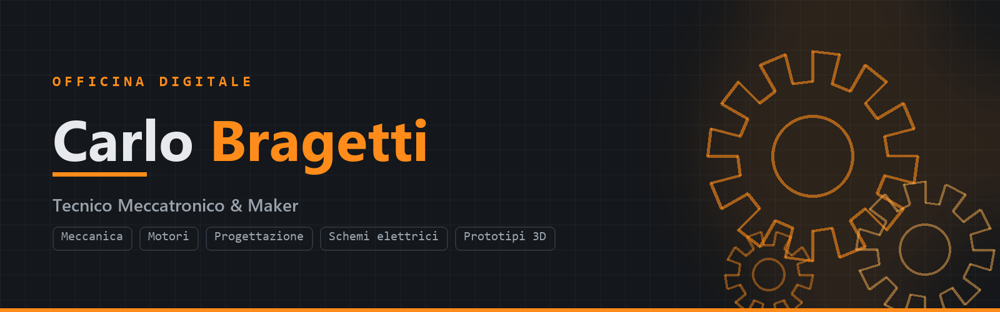

---

## 🛠️ Chi sono

Dottorando in **Ingegneria Meccanica** e Tecnico Meccatronico, con background da perito informatico.
Mi muovo tra l'officina e il codice: preparo motori a regola d'arte, progetto componenti per motori
e telai, e scrivo il **software** che automatizza il lavoro tecnico.

Metodo **problem-driven**: parto dal problema reale, costruisco la versione più piccola che funziona,
misuro e itero — documentando il *perché* lungo la strada (spesso sul [blog](https://carlobragetti.github.io)).

- 🔧 **Meccanica & motori** — blueprinting, metrologia, equilibratura, assetti da cronoscalata
- 📐 **Progettazione** — CAD parametrico (Fusion), DFM, stampa 3D e prototipazione
- ⚡ **Elettronica** — schemi, circuiteria elettrauto, sensori/relè/cablaggi
- 💻 **Software & AI** — Python, automazione, pipeline, prompt engineering
- 🎬 **3D & motion** — grafica e animazioni (After Effects)

---

## 🧰 Stack &amp; strumenti

 

 

---

## 🚀 Progetti in evidenza

- **[pdf-to-csv](https://github.com/CarloBragetti/pdf-to-csv)** — estrae dati da cataloghi tecnici PDF
  (automotive) in CSV, con un esploratore web *range-aware*. Python · PyMuPDF · Streamlit · stlite
  ([demo](https://carlobragetti.github.io/pdf-to-csv/)).
- **[Officina — blog di ingegneria](https://github.com/CarloBragetti/CarloBragetti.github.io)** — sito
  tecnico (Jekyll, tema custom, CI/CD) su meccanica, motori, progettazione, elettronica e prototipi 3D.
- **image-to-CAD pipeline** *(in corso)* — da foto a *digital twin* solido parametrico via Fusion API.

### 🔩 In officina (oltre al codice)
- **Preparazione motore Aprilia RSV4 1000** — blueprinting completo del V4 ([articolo](https://carlobragetti.github.io)).
- **Revisione integrale Mini Cooper** — da impianto elettrico a motore/trasmissione, assetto da cronoscalata.

---

## 📊 GitHub in breve

---

## 🌱 In questo periodo

- Pipeline **foto → CAD** (mesh → solido parametrico) e automazione con LLM/MCP
- Più articoli tecnici sul blog

---

📫 **[carlo.bragetti@gmail.com](mailto:carlo.bragetti@gmail.com)** ·
🌐 **[carlobragetti.github.io](https://carlobragetti.github.io)** ·
💼 **[LinkedIn](https://www.linkedin.com/in/carlo-bragetti-25b489208/)** ·
▶️ **[@RevoArtWorks](https://www.youtube.com/@RevoArtWorks)**

📍 Perugia, Umbria, Italia

